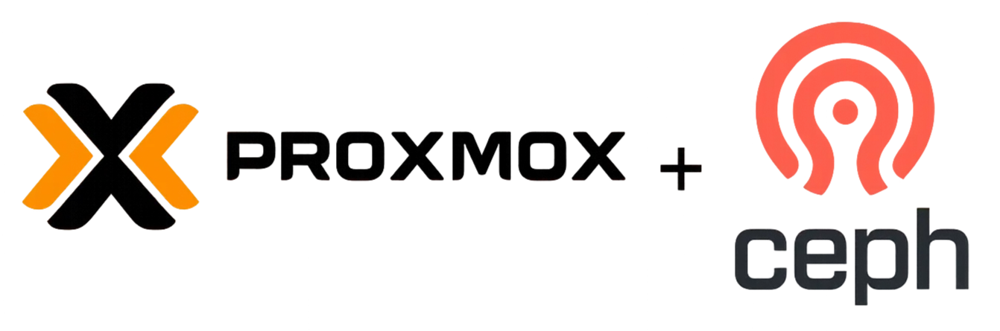
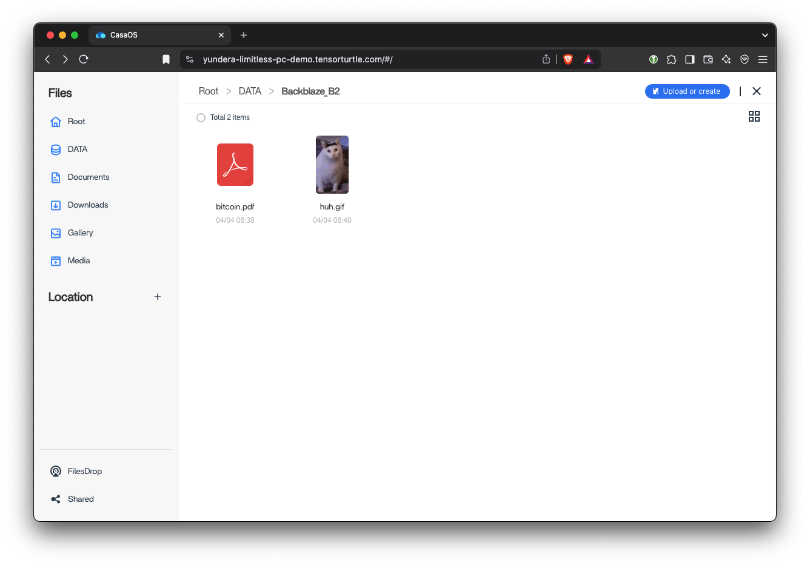
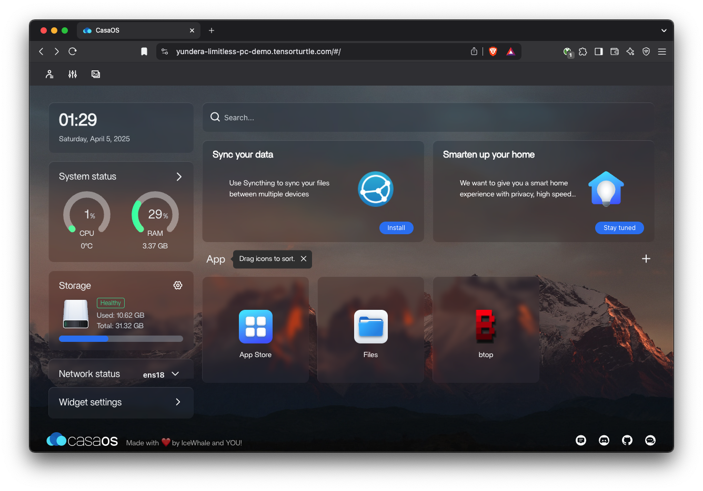
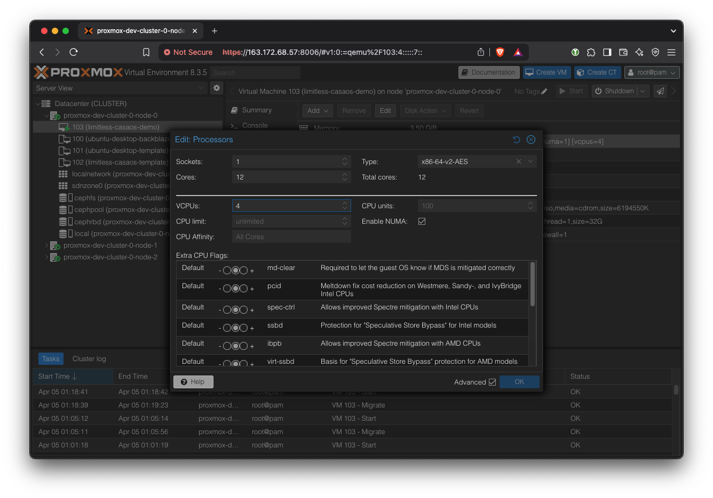
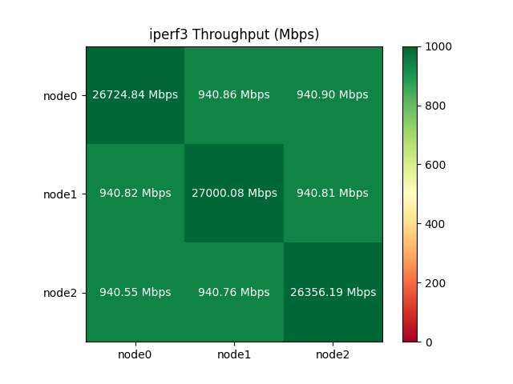
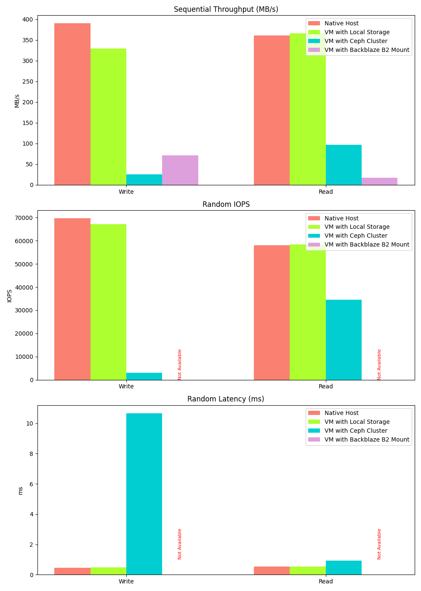
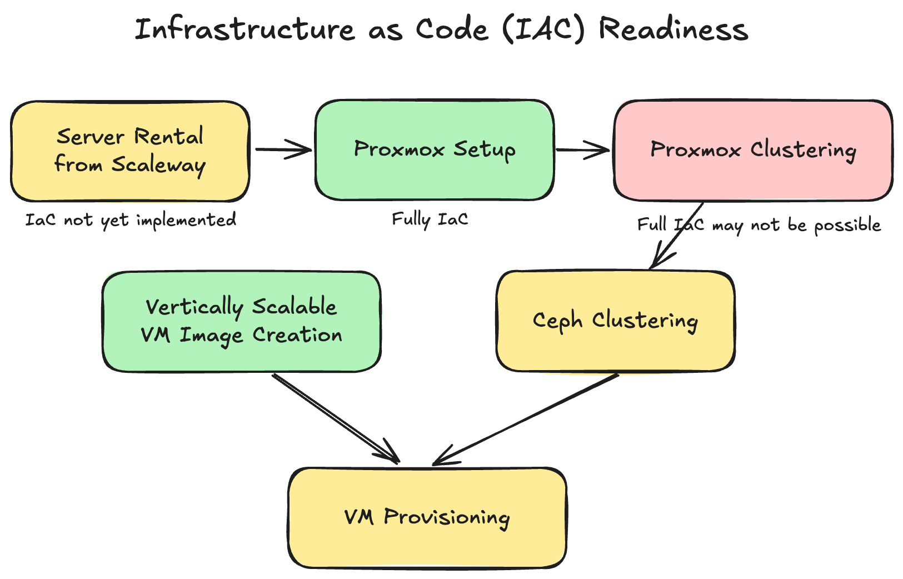

# Yundera Limitless PC Project

by Jason Sohn

# **Executive Summary**

This report outlines the successful development of a proof-of-concept VM that enables **zero-downtime vertical scaling of virtual machines**, a feature currently unavailable on mainstream cloud platforms. Built for Yundera’s user-centric model, the solution leverages open-source technologies (**Proxmox VE** for virtualization and **Ceph** for distributed storage) deployed on bare-metal servers from Scaleway.

The proof of concept demonstrates that computing resources such as CPU, memory, and storage can be dynamically scaled without interrupting user workloads, paving the way for a "limitless PC" experience. Key advantages include lower vendor lock-in, cost-efficiency, and operational flexibility. The project also shows that live migration across servers is not only viable but nearly imperceptible to users.

Based on these findings, the report recommends progressing toward production by implementing infrastructure-as-code, usage-based billing, and enhanced security measures. This positions Yundera to offer a unique, scalable alternative to traditional cloud computing.

# Background

## State of the Public Cloud

No public cloud provider offers zero-downtime vertical scaling of VMs. While technical and historical factors play a role, the most compelling explanation lies in misaligned business incentives. Cloud providers have subtly fostered vendor lock-in by encouraging companies to invest engineering resources in specialized code tailored for horizontal scaling ecosystem products. Furthermore, cloud vendors have little incentive to offer live vertical scaling for VMs, as they can promote more profitable products, such as AWS Lambda, which require vendor-specific development efforts.

## Yundera’s Unique Offering

Yundera is built on a more focused tech stack and has a different incentive structure than commodity cloud providers, which opens up an opportunity to provide true pay-as-you-go service. 

## Approaches Considered

---

### **Commercial Cloud VM Migration (Blue-Green Deployment)**

Using a commercial cloud provider’s tools, we could automate a VM backup, duplication, and restore workflow.

**Pros**

- Architectural simplicity: We do not create any additional abstraction layers.
- No need to provision extra resources - this is handled by the cloud provider

**Cons**

- Vendor lock-in
- Noticeable interruption to end user because the change is not in-place.
- Limited customizability.
- Does not provide a truly 'limitless PC' experience.

---

### **OpenStack**

**Pros**

- OpenStack provides a platform for building a large-scale, AWS-like, self-service cloud.

**Cons**

- Complex, steep learning curve, heavy infrastructure footprint.
- Assumes a large technical team will build and manage the infrastructure.
- Live CPU/RAM resizing will “never be implemented”.[1][2]

---

### **oVirt**

**Pros**

- Similar in many ways to Proxmox
- Free and open source

**Cons**

- Smaller community
- Requires dedicated management node
- No option for enterprise support
- No built-in container support

---

## Approach Selected

Proxmox VE and Ceph were chosen as the most promising path towards building a limitless PC service that is scalable to 1000 users and beyond.

**Proxmox VE** is an open-source hypervisor for both VMs and containers. It supports in-place VM scaling, a key requirement, with only minor modifications to host and VM configurations.

**Proxmox Benefits**

- Open-source and free
- KVM (VMs) and LXC (containers) support
- User-friendly web interface
- Cluster management built-in
- Strong and active community

**Proxmox Costs / Considerations**

- Optional enterprise license
- Administration requires familiarity with Linux concepts (all of the above options do too)

**Ceph** is an open-source distributed file system that is suitable for VM system file storage. It is the default option for pooled storage for a Proxmox cluster. For simplicity, all three nodes are members of both the Proxmox and Ceph clusters. Separating these clusters onto dedicated machines is possible in theory, but not explored here.

**Ceph Benefits**

- Built for hyper-converged architecture
- First-class Proxmox integration.
- Enables sub-second VM migrations across hosts by eliminating the need to copy VM images.

**Ceph Costs / Considerations**

- Greater demand on the network - SSDs can easily saturate 10 GbE, causing the network to become the bottleneck.
- Requires some technical knowledge and familiarity with Ceph-specific concepts to set up and maintain.

# Setup

# Try the Proof of Concept VM

Open the proof-of-concept demo:

[https://yundera-limitless-pc-demo.tensorturtle.com](https://yundera-limitless-pc-demo.tensorturtle.com)

Username: `yundera-developer`

Password: Please contact me directly for POC VM password.

## Backblaze Mount

Open ‘Files’. A demo ‘Backblaze_B2’ bucket is automatically mounted at boot.

This gives users intuitive, easy-to-use access to the practically infinite Backblaze storage.

Try downloading / uploading files to this Backblaze B2 mount.

## Live CPU/RAM Scaling

This is the exciting part. From the CasaOS home, open the `btop` application. This is a system monitoring application. 

`btop` shows us CPU (upper right) and RAM (left center), among other stats.

With `btop` open in one window, log into the Proxmox cluster web UI in another window:

[https://163.172.68.57:8006](https://163.172.68.57:8006/)

Since the Proxmox is clustered, you can access the same web UI from the other two servers too:

[https://163.172.68.59:8006](https://163.172.68.59:8006/)

[https://163.172.68.106:8006](https://163.172.68.106:8006/)

You can safely ignore the warning. It occurs simply because Proxmox web UI uses a self-signed TLS. It is safe to continue and we can remove this warning later.

On Chrome, click on `Advanced` and then click on `Proceed to 163.172.68.57 (unsafe)`

On Firefox, click on `Advanced`and then `Accept the Risk and Continue`.

The user name is `root`

Contact me directly for the Proxmox cluster passwords.

Acknowledge the “No valid subscription” alert. All Proxmox features are free but the developers recommend us to buy a support plan from them, which provides access to one of their engineers.

Navigate to the `limitless-casaos-demo` VM. Then go to ‘Hardware’ tab.

**Add RAM**: Simply double click on ‘Memory’ and change it to something bigger, like 8000 MB.

In the `btop` window, you should see that the total RAM instantly increased. Adding RAM is an instant change, so you might miss it if you blink.

**Remove RAM**: Similarly, edit the ‘Memory’ back to 4000 MB. This time, the change won’t be instant because the hypervisor slowly and carefully reclaims unused memory. As a rule of thumb, it takes around 1 second per GB of memory to be freed. If you request more memory to be removed than is possible, the operation won’t complete.

**Add CPU**: Edit ‘Processors’. We want to change the ‘VCPUs’ field, not the ‘Cores’ field. Try changing it to 8 VCPUs and click OK.

Refresh the `btop` page, and you’ll see that more cores have been added. Adding CPUs is actually instantaneous, but almost all system monitoring applications need to be refreshed to show the new core count.

**Remove CPU**: In Proxmox, reset the VCPUs count back to 4. Removing CPUs is quite fast but not instantaneous because the CPU has to move processes from the cores that will be removed. The rule of thumb is 0.5 seconds per core. Refresh the VM’s `btop` window to see the new core count.

# Results

## Hot-Plugging Capabilities

Our experiments demonstrate that our multi-node Proxmox cluster with Ceph storage can be dynamically scaled in any dimension (CPU, RAM, storage) with minimal interruption under most circumstances.

| Resource | Scaling Direction | Always possible | Scaling Limits | Speed | Possible Workarounds |
| --- | --- | --- | --- | --- | --- |
| CPU | Add Cores | **✅** | Cannot exceed number of remaining cores in the physical host. The maximum must be set before VM startup. | Instant |  |
|  | Remove Cores | **✅** |  | ~1 second per core - OS needs to move processes |  |
| RAM | Add RAM | **✅** | Cannot exceed host RAM | Instant |  |
|  | Remove RAM | **🟠** | Operation can fail if current RAM usage is greater than target RAM. | ~1 second per GB of RAM shrunk (Ballooning process) | Verify that current RAM usage is below target size before allowing this operation. |
| Boot Disk | Increase Size | **🟠** | Expanding boot disk is possible, but the boot partition cannot be changed without careful operations and rebooting. |  | Create a new (non-boot) partition for expanded storage on boot disk. |
|  | Decrease Size | **❌** | Not possible. |  |  |
| Remote Disk (S3) | Mount | **✅** |  | Instant |  |
|  | Unmount | **✅** | Can’t unmount if currently being written to | Instant |  |

## Cross-Host VM Migration

In cases where the current host does not have sufficient headroom to accommodate a more resource-intensive VM, it will need to be migrated to another host.

We demonstrate sub-second migration and full state persistence during cross-host VM migration.

When connected via SSH, the unresponsiveness during migration is imperceptible.

CasaOS experiences approximately 10-30 seconds of unresponsiveness, likely due to differences in how CasaOS handles the network interruption compared to the underlying network stack.

Using **`scp`** to copy a file over the internet, the VM experiences a 5-15 second stall during migration, but the transfer resumes and completes successfully even through multiple migrations.

# Analysis and Discussion

## Performance

### Host-to-host Measurements

In our POC cluster, three servers were located within the same rack (as indicated by the Scaleway console), and shared a IPv4 gateway. The specifics of the networking is opaque to us, but we can make a safe guess that they were all wired up to a L2 switch, and therefore could communicate directly. 

The following correlation matrix shows that ping times were consistently low and well under the 5ms maximum required for a Proxmox cluster[3]. Host-to-host ping times should be measured in this manner for all deployments. Furthermore, it is recommended to use a physically separate network card or interface for Corosync (the real-time synchronization engine), and further work is needed to configure dual-NIC servers in this way and stress-test the cluster.

Similarly, the measured throughput showed nearly ideal performance for a 1Gbps network interface. The diagonal is the loopback interface, which is much faster than external networking as expected.

### Native vs. Ceph vs. Backblaze Storage Performance

Hyper-converged storage via a Ceph cluster offers great flexibility at the cost of performance. 

Currently, the Ceph and Backblaze mount performance appears comparable. This is misleading, however. We can easily upgrade our Ceph cluster with better networking to improve its performance 10x. On the other hand, Backblaze is over the internet so our ability to directly improve it is much more limited.

The host servers have SATA SSD storage (typically 400-500MB/s throughput). A KVM-based VM can fully utilize this bandwidth when using local storage. However, when using Ceph, gigabit networking limitations (128MB/s theoretical) and network filesystem overhead significantly hinder performance. These limitations can be mitigated with improved hardware.

Further research is needed to quantify the potential improvements gained by deploying a more suitable 10 gigabit+ network or using NVME SSD servers.

Random write/read data could not be collected for Backblaze mount because `fio` encountered errors when running tests on the mounted directory. This is typical of the kind of rough edges that occur when using a S3-like object store as a POSIX file system. The author’s guess is that the random read/write performance for Backblaze is going to be quite terrible.

## Cost Considerations

While a detailed cost projection and optimization for a fully scaled system is beyond the scope of this report, we can offer some constraints and recommendations based on the current technology stack.

Proxmox and Ceph clusters benefit significantly from a fast network. Scaleway CORE offers machines with 25 Gbps, making them a suitable choice. Servers with less than 10 Gbps should be avoided.

Although there is no theoretical limit to the size of Proxmox clusters, larger clusters may experience increased overhead and instability. Therefore, keeping it below 10 is considered a safe rule of thumb. To host 1000 total VM users, each server will need to be quite powerful (with 100+ logical cores). Beyond that, a multi-cluster setup should be considered.

If we want to offer lots of within-cluster storage, we can add Scaleway STORE servers seamlessly into the Ceph cluster. The hyper-converged architecture makes such configurations essentially plug-and-play.

## Clustering & Redundancy

Currently, with three-way replication for redundancy, our three 256GB SSDs provide only 256GB of usable Ceph RBD storage. This represents a worst-case scenario; adding more drives will significantly improve the usable capacity ratio.

## Upkeep Cost

Proxmox software and its full functionality are available free of charge. The primary upkeep cost is the hardware rental. Proxmox offers optional 'Enterprise Plans,' recommended for production environments, which provide enterprise-level engineering support.

## Dependencies and Maintenance

The POC relies on very popular open source software with well-defined governance and historical reliability. There are very few dependencies or maintenance items besides updating the Proxmox hypervisor and the Debian-based image.

# Next Steps

## Application Performance Testing

Further testing is required to ensure that all end-user applications properly utilize newly allocated resources without requiring a system reboot. While most multi-threaded processes will seamlessly adapt to additional cores, some single-threaded legacy applications may not.

## Full Infrastructure-As-Code (IaC)

The goal of IaC is to provision infrastructure automatically and declaratively by writing code instead of manual configuration. In parts of the ‘Setup’ section, manual web UI based methods were shown for convenience and for better intuition. Further development work is needed to bring the whole process into IaC. The following diagram highlights areas (yellow) where IaC remains to be implemented. Proxmox provides a comprehensive API, so this task is not expected to encounter any feasibility barriers.[4]

## Thin Provisioning through Usage Analysis

Thin provisioning involves allocating more storage or CPU resources to customers than are physically available, based on the assumption that users will not simultaneously exhaust their allocated resources.

Further analysis is required to determine an appropriate safety margin for implementing this cost optimization strategy.

## Metering & Billing System

Development of a metering and billing system that can accurately track the dynamic resource usage as demonstrated here is key for future work, including identifying metrics and implementing a billing engine. Integration with the Proxmox API to programmatically access VM metadata will facilitate this task.

## VM Isolation and Network Hardening

Currently, basic levels of inter-VM isolation is already in place. However, more security analysis and penetration testing is required to ensure that VM isolation cannot be broken.

## Autoscaling

Currently, VM migration for resource optimization is a manual process. Several third-party solutions aim to address this: [ProxLB](https://github.com/gyptazy/ProxLB) automates VM migration based on dynamic resource usage, while [proxmox-vm-autoscale](https://github.com/fabriziosalmi/proxmox-vm-autoscale) dynamically adjusts VM resources based on CPU/RAM utilization. Further investigation and evaluation are needed to determine the optimal implementation strategy for these solutions.

## Further Questions

### Orthogonality of Vertical Scaling

To what extent will we allow customers to independently scale CPU, RAM, and storage? Will we offer unrestricted combinations of these resources, pre-set ratios, or flexibility within defined ranges?

These considerations are important because mismatches between aggregate customer resource demands and the cluster’s aggregate physical resource ratios can lead to inefficiencies.

### Terms & Quality of Service

Our results demonstrate near-zero downtime vertical scaling within our POC cluster, with the exception of cross-host migrations. Moving forward, we need to define and communicate our Quality of Service (QoS) policy to customers: Should VM migrations be limited to instances where customers request resource changes, or can we also migrate VMs proactively to optimize infrastructure costs? Further discussion is needed to determine the appropriate balance between fairness, predictability, and cost optimization.

# Resources

[1] [https://docs.openstack.org/nova/latest//user/resize](https://docs.openstack.org/nova/latest//user/resize) 

[2] [https://bugs.launchpad.net/nova/+bug/2017829#:~:text=I understand that openstack doesn't,it possible to support it](https://bugs.launchpad.net/nova/+bug/2017829#:~:text=I%20understand%20that%20openstack%20doesn%27t,it%20possible%20to%20support%20it)

[3] [https://pve-proxmox.com/pve-docs/chapter-pvecm.html](https://pve.proxmox.com/pve-docs/chapter-pvecm.html)

[4] [https://pve.proxmox.com/pve-docs/api-viewer](https://pve.proxmox.com/pve-docs/api-viewer)

[5] [https://pve.proxmox.com/wiki/Hotplug_(qemu_disk,nic,cpu,memory)](https://pve.proxmox.com/wiki/Hotplug_(qemu_disk,nic,cpu,memory))